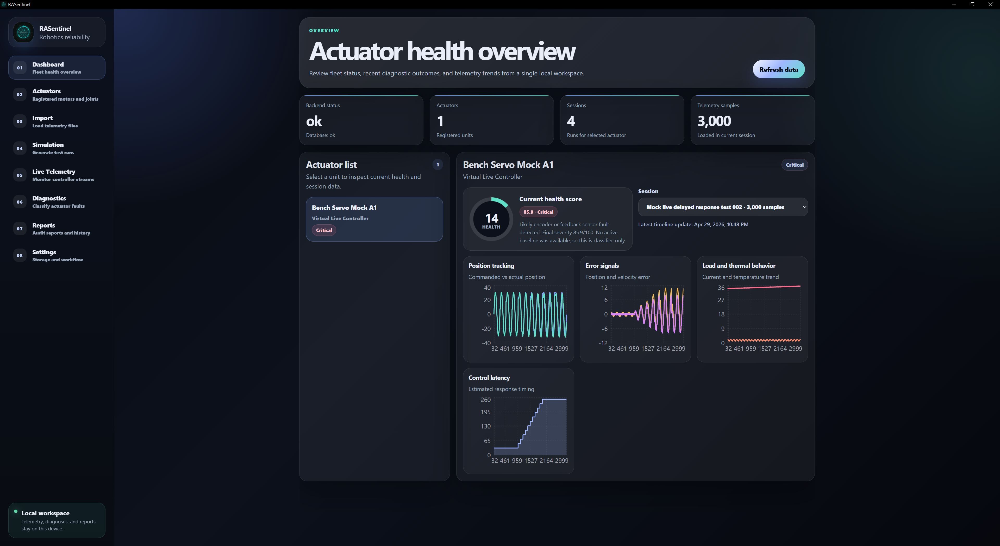
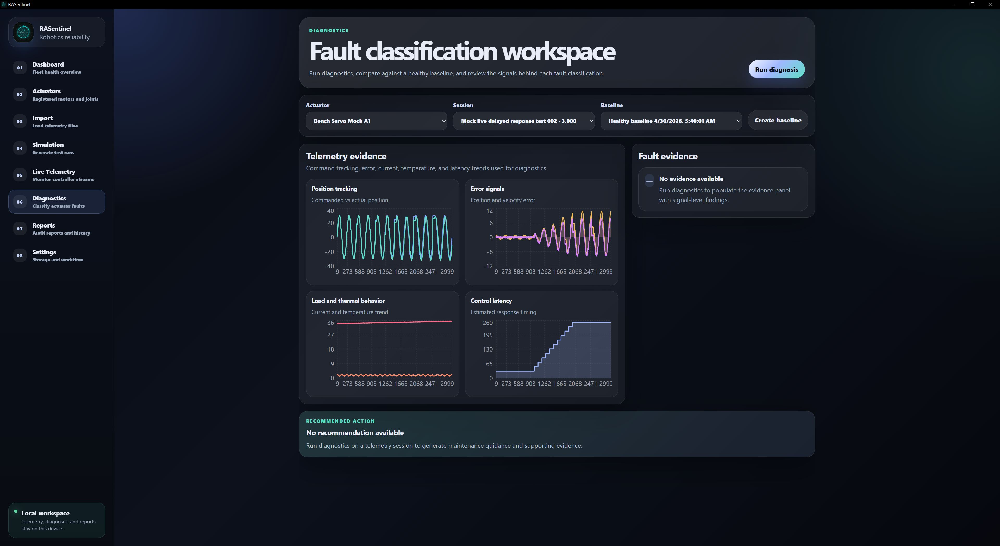
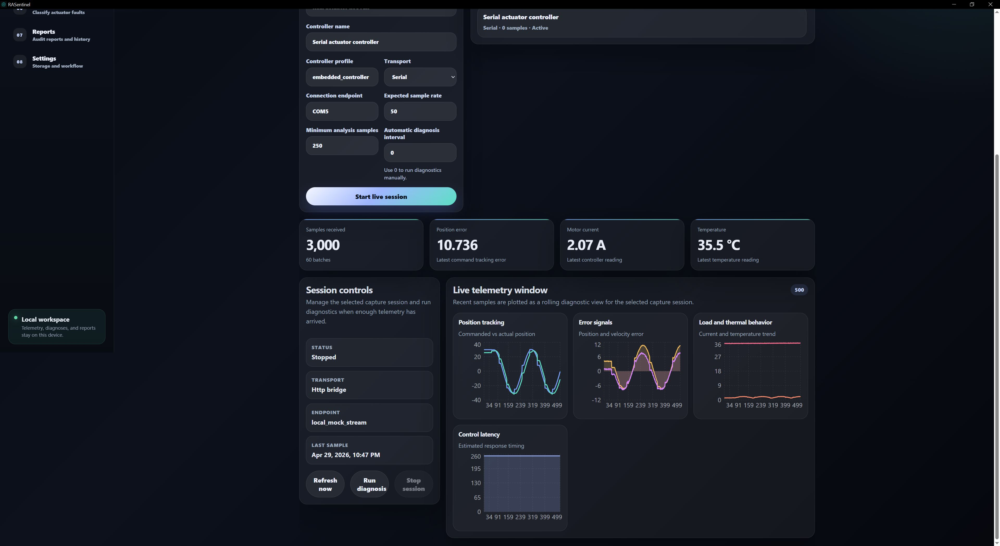
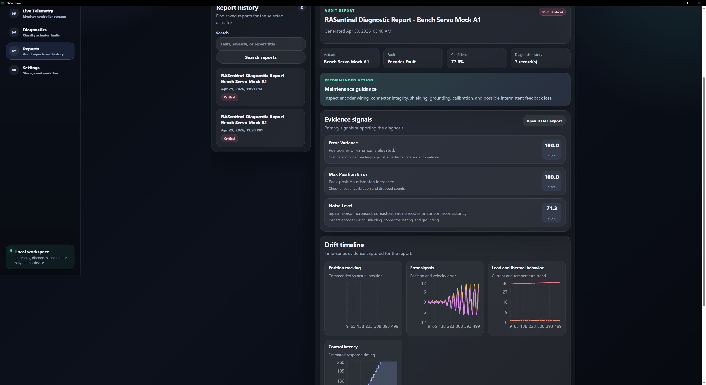
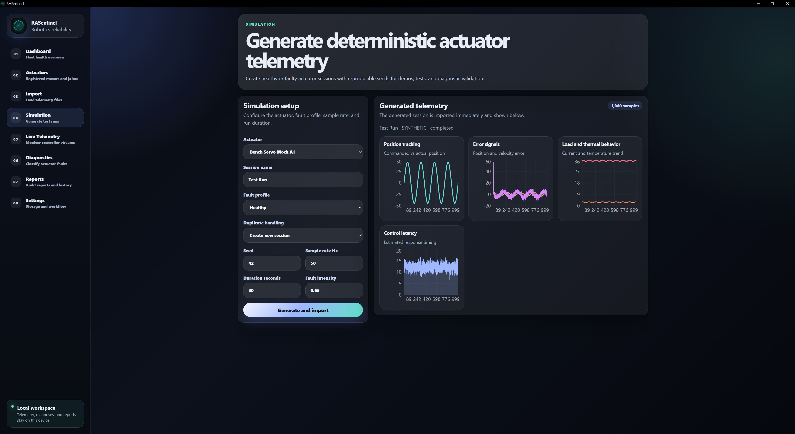
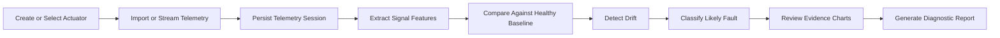
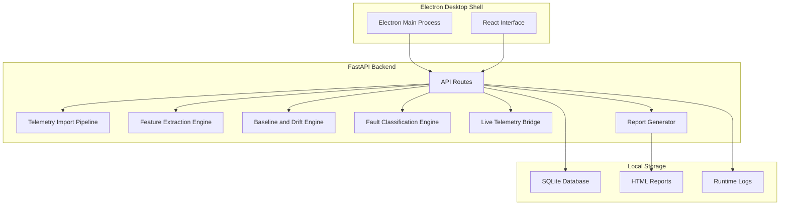
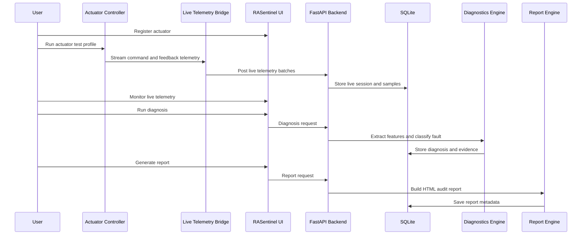

<p align="center">
  
</p>

<h1 align="center">RASentinel</h1>

<p align="center">
  <strong>Private actuator health monitoring for robotics, motion systems, and industrial automation.</strong>
</p>

<p align="center">
  RASentinel turns controller telemetry into actionable reliability insight by tracking actuator response, measuring drift against healthy baselines, classifying fault indicators, and generating traceable diagnostic reports.
</p>

<p align="center">
  
  
  
  
  
</p>

<p align="center">
  
  
  
  
</p>

---

## Overview

RASentinel is a local-first actuator diagnostics platform for robotics, motion systems, and automation environments.

It analyzes commanded and measured telemetry to evaluate actuator response, detect performance drift, and identify early signs of mechanical, electrical, thermal, or feedback-related faults. Instead of treating telemetry as raw logs, RASentinel converts each session into structured diagnostic evidence: tracking error, response delay, current behavior, temperature trends, oscillation patterns, encoder consistency, and deviation from healthy baselines.

The system supports a complete desktop workflow: register actuators, import or stream telemetry, build baselines, run diagnostics, review evidence charts, and generate local audit reports.

RASentinel is designed for private, traceable actuator reliability analysis where data should remain on the workstation and every diagnosis should be supported by visible signals.

---

## Screenshots

<table>
  <tr>
    <td width="50%">
      
      <p align="center"><strong>Dashboard</strong><br/>Fleet-level actuator health, session status, telemetry counts, and current diagnostic state.</p>
    </td>
    <td width="50%">
      
      <p align="center"><strong>Diagnostics</strong><br/>Feature extraction, baseline comparison, fault classification, severity scoring, and evidence review.</p>
    </td>
  </tr>
  <tr>
    <td width="50%">
      
      <p align="center"><strong>Live Telemetry</strong><br/>Near-real-time telemetry monitoring from controller bridge sessions.</p>
    </td>
    <td width="50%">
      
      <p align="center"><strong>Reports</strong><br/>Saved diagnostic history, audit report previews, evidence signals, and maintenance guidance.</p>
    </td>
  </tr>
  <tr>
    <td colspan="2">
      
      <p align="center"><strong>Simulation Lab</strong><br/>Repeatable healthy and faulty actuator telemetry generation for testing, validation, and demonstrations.</p>
    </td>
  </tr>
</table>

---

## Why RASentinel Exists

Robotic systems often fail gradually before they fail loudly.

A degrading actuator may first show:

- increasing position error,
- delayed response to commands,
- higher current draw,
- thermal rise,
- encoder inconsistency,
- oscillation,
- backlash-like looseness,
- abnormal settling behavior,
- reduced velocity response,
- or worsening deviation from a known healthy baseline.

In many systems, these signals are present but scattered across logs, controller outputs, CSV exports, firmware traces, and operator observations. RASentinel brings them into a single local workflow where the diagnosis is not just a label. It includes the telemetry session, extracted features, baseline comparison, fault evidence, severity, confidence, and maintenance recommendation.

The core idea is simple:

> A robotics diagnostic result should be explainable from the signals that produced it.

No mystery score. No generic “anomaly detected” badge with a dramatic color. No caffeinated oracle inventing failure modes because the chart looked spicy.

---

## What RASentinel Can Do

### Actuator Registry

RASentinel maintains a local registry of actuators and joints. Each actuator can store metadata such as name, type, location, manufacturer, model number, serial number, ratings, and current health state.

Supported actuator categories include:

- servo actuators,
- DC motors,
- stepper motors,
- linear actuators,
- hydraulic actuators,
- pneumatic actuators,
- unknown/custom actuators.

### Telemetry Import

RASentinel can import actuator telemetry from:

- CSV files,
- JSON files,
- synthetic simulator output,
- live controller bridge sessions.

Telemetry is validated before storage so malformed rows do not quietly poison the analysis pipeline like a tiny spreadsheet goblin.

### Simulation Lab

The simulator generates repeatable healthy and faulty actuator telemetry. It supports reproducible seeds and configurable actuator behavior.

Fault profiles include:

- healthy actuator,
- friction increase,
- backlash,
- encoder noise,
- motor weakening,
- overheating,
- delayed response,
- load imbalance,
- oscillation/control instability,
- current spike anomaly.

This makes it possible to test the full system without physical hardware.

### Signal Processing and Feature Extraction

RASentinel converts raw telemetry into robotics-specific diagnostic features.

Example extracted features:

- mean position error,
- max position error,
- mean velocity error,
- response delay,
- overshoot percent,
- settling time,
- steady-state error,
- current drift percent,
- temperature rise rate,
- error variance,
- oscillation score,
- health deviation score.

Feature extraction is deterministic and built to handle missing values safely.

### Baseline and Drift Detection

A healthy baseline can be created from a known-good session. Later sessions can be compared against that baseline to detect drift.

The drift engine identifies:

- gradual performance degradation,
- sudden anomalies,
- deviation from healthy behavior,
- worsening trend patterns,
- signals contributing to the drift score.

The output includes a severity score and evidence signals instead of just a number wearing a lab coat.

### Fault Classification

RASentinel includes a rule-based fault classifier with optional anomaly scoring support. It classifies likely actuator faults using extracted features and drift evidence.

Supported fault classes include:

- friction increase,
- backlash,
- encoder fault,
- motor weakening,
- thermal stress,
- control instability,
- delayed response,
- load imbalance,
- unknown anomaly.

Each diagnosis includes:

- likely fault type,
- severity score,
- confidence score,
- supporting evidence,
- recommended maintenance action.

### Live Hardware Telemetry Bridge

RASentinel supports near-real-time actuator analysis through a live telemetry bridge.

The current bridge architecture is read-only by design:

```text
Actuator Controller
        ↓
Telemetry Bridge
        ↓
RASentinel Live API
        ↓
SQLite Session Storage
        ↓
Rolling Feature Extraction
        ↓
Live Diagnosis
        ↓
Dashboard and Reports
```

This allows RASentinel to analyze controller telemetry without taking over actuator control. Motion control, safety limits, PID loops, emergency stop, and motor protection remain the responsibility of the hardware controller.

That separation is intentional. Diagnostic software should not casually become the thing that commands motors. Robots already have enough ways to become unpleasant.

### Reports and Audit History

RASentinel generates local HTML diagnostic reports.

Reports include:

- actuator information,
- telemetry session summary,
- detected fault,
- severity and confidence,
- evidence signals,
- drift timeline,
- recommended action,
- technical notes.

Reports are stored locally and can be searched from the Reports page.

---

## Product Workflow



---

## Architecture

RASentinel uses a desktop architecture with a local backend, local storage, and a React-based diagnostic interface.



---

### Backend

The backend is implemented with **FastAPI** and **SQLAlchemy**. It exposes typed routes for actuators, telemetry sessions, simulation, imports, feature extraction, baselines, diagnostics, live telemetry, reports, and benchmarks.

Primary responsibilities:

- API routing,
- request validation,
- local persistence,
- simulator execution,
- telemetry ingestion,
- feature extraction,
- drift detection,
- fault classification,
- report generation,
- release benchmarks.

### Frontend

The frontend is implemented with **React**, **TypeScript**, and **Recharts**.

Primary responsibilities:

- product navigation,
- actuator registry UI,
- import workflows,
- simulation workflows,
- live telemetry monitoring,
- diagnostics workspace,
- report history,
- evidence visualization,
- settings and storage transparency.

### Desktop Shell

The desktop shell uses **Electron** to provide a local application experience without requiring users to manually open a browser.

Primary responsibilities:

- launch local backend,
- open desktop UI window,
- manage app icon and window identity,
- point runtime storage to AppData,
- keep the project folder clean from generated runtime data.

### Local Storage

RASentinel uses SQLite for structured data and local files for reports/logs.

On Windows desktop builds, runtime data is stored under:

```text
C:\Users\<User>\AppData\Roaming\rasentinel-desktop\data
```

The repository itself should contain source code, docs, assets, and tests. Runtime databases should not live inside the project folder.

---

## Repository Structure

```text
RASentinel/
├── assets/
│   └── branding/
│       └── source.png
│
├── backend/
│   ├── app/
│   │   ├── api/
│   │   ├── core/
│   │   ├── db/
│   │   ├── models/
│   │   ├── schemas/
│   │   ├── services/
│   │   └── main.py
│   ├── tests/
│   ├── requirements.txt
│   └── pytest.ini
│
├── desktop/
│   ├── assets/
│   ├── src/
│   ├── electron-builder.yml
│   └── package.json
│
├── docs/
│   ├── screenshots/
│   ├── architecture.md
│   ├── security_and_privacy.md
│   ├── testing.md
│   └── real_servo_actuator_realtime_integration.md
│
├── frontend/
│   ├── public/
│   ├── src/
│   │   ├── components/
│   │   ├── navigation/
│   │   ├── pages/
│   │   ├── services/
│   │   ├── types/
│   │   └── main.tsx
│   └── package.json
│
├── hardware/
│   └── esp32_json_telemetry_example/
│
├── scripts/
│   ├── prepare_app_assets.py
│   ├── mock_live_actuator_stream.py
│   ├── live_serial_bridge.py
│   ├── run_backend_appdata.ps1
│   ├── run_desktop.ps1
│   └── run_desktop_dev.ps1
│
└── README.md
```

---

## Core Data Model

RASentinel is centered around a few core entities:

| Entity | Purpose |
|---|---|
| Actuator | A registered motor, joint, drive, or actuator unit. |
| Session | A telemetry run linked to an actuator. |
| Telemetry Sample | A timestamped command/measurement row. |
| Feature Set | Extracted diagnostics features for a session. |
| Healthy Baseline | Known-good reference features for an actuator. |
| Diagnosis Result | Fault classification, severity, confidence, and evidence. |
| Report Record | Saved audit report metadata and exported HTML path. |
| Live Session | A near-real-time controller stream session. |

Example telemetry fields:

```text
timestamp
actuator_id
commanded_position
actual_position
commanded_velocity
actual_velocity
commanded_torque
estimated_torque
motor_current
temperature
load_estimate
control_latency_ms
encoder_position
error_position
error_velocity
fault_label
```

---

## Diagnostic Logic

RASentinel does not treat telemetry as generic time-series data. The analysis is based on actuator-specific behavior.

### Position and Velocity Tracking

The system compares commanded and measured motion to identify actuator lag, mechanical looseness, reduced response, or controller instability.

### Current and Thermal Behavior

Current and temperature trends help distinguish faults such as friction increase, load imbalance, motor weakening, and overheating.

### Latency and Response Timing

Control latency and movement delay support delayed-response classification and baseline comparison.

### Error Variance and Oscillation

Increased error variance, repeated direction changes, or unstable measured response can indicate control instability, encoder issues, or mechanical vibration patterns.

### Baseline Deviation

A known-good baseline allows RASentinel to calculate health deviation using signal-specific thresholds.

---

## Fault Classification Matrix

| Fault Type | Typical Evidence |
|---|---|
| Friction Increase | Higher current, rising temperature, growing position error. |
| Backlash | Position error around direction changes, delayed correction, mechanical looseness pattern. |
| Encoder Fault | Encoder inconsistency, noise spikes, impossible position changes. |
| Motor Weakening | Reduced actual velocity/torque response under normal command. |
| Thermal Stress | Temperature rise rate, sustained high temperature, current coupling. |
| Control Instability | Oscillation score, repeated overshoot, unstable settling behavior. |
| Delayed Response | Increased response delay, tracking lag, slow convergence. |
| Load Imbalance | Current increase with position/velocity deviation under load. |
| Unknown Anomaly | Elevated drift without a confident known fault pattern. |

---

## Real-Time Hardware Integration

RASentinel can analyze real actuator telemetry through the live bridge.

Supported integration pattern:

```text
Servo / Actuator
        ↓
Motor Driver / Controller
        ↓
Microcontroller, PLC, ROS2 node, or controller service
        ↓
JSON telemetry over Serial / USB / bridge adapter
        ↓
RASentinel Live API
```

The bridge expects timestamped samples shaped like:

```json
{
  "commanded_position": 10.0,
  "actual_position": 9.82,
  "commanded_velocity": 2.0,
  "actual_velocity": 1.88,
  "commanded_torque": 1.2,
  "estimated_torque": 1.35,
  "motor_current": 2.4,
  "temperature": 39.1,
  "load_estimate": 0.42,
  "control_latency_ms": 18.0,
  "encoder_position": 9.81
}
```

For a full hardware walkthrough, see:

```text
docs/real_servo_actuator_realtime_integration.md
```

---

## Demo Flow

RASentinel is designed around actuator telemetry captured from a controller, driver, embedded board, PLC, or robotics middleware node.



Recommended live actuator workflow:

1. Open the RASentinel desktop app.
2. Register the actuator with its type, location, controller, and expected operating context.
3. Connect the actuator controller through USB serial, a controller log stream, ROS2 bridge, or another telemetry adapter.
4. Start a known-good actuator run and capture telemetry into RASentinel.
5. Create a healthy baseline from the known-good run.
6. Run a second actuator test under load or an observed fault condition.
7. Monitor position tracking, current behavior, temperature trend, response latency, and error growth.
8. Run diagnostics on the captured session.
9. Review the fault classification, severity score, confidence score, and supporting evidence.
10. Generate the local diagnostic report.

Example live bridge command:

```powershell
cd F:\Projects-INT\RASentinel
.\backend\.venv\Scripts\activate

python .\scripts\live_serial_bridge.py `
  --port COM5 `
  --baud 115200 `
  --actuator-id YOUR_ACTUATOR_ID `
  --session-name "Live actuator load test 001" `
  --duration-s 60 `
  --batch-size 100 `
  --diagnose-every 1000
```

### Frontend Setup

```powershell
cd F:\Projects-INT\RASentinel\frontend
pnpm install
pnpm build
pnpm test
```

### Desktop Setup

```powershell
cd F:\Projects-INT\RASentinel\desktop
pnpm install
```

---

## Running RASentinel

### Desktop App

```powershell
cd F:\Projects-INT\RASentinel
powershell.exe -NoProfile -ExecutionPolicy Bypass -File .\scripts\run_desktop.ps1
```

### Backend Only

```powershell
cd F:\Projects-INT\RASentinel
powershell.exe -NoProfile -ExecutionPolicy Bypass -File .\scripts\run_backend_appdata.ps1
```

### Frontend Development

```powershell
cd F:\Projects-INT\RASentinel\frontend
pnpm dev
```

### Desktop Development

```powershell
cd F:\Projects-INT\RASentinel
powershell.exe -NoProfile -ExecutionPolicy Bypass -File .\scripts\run_desktop_dev.ps1
```

---

## Testing

RASentinel includes backend and frontend tests.

### Backend Tests

```powershell
cd F:\Projects-INT\RASentinel\backend
.\.venv\Scripts\activate
pytest
```

Backend test coverage includes:

- health route,
- actuator workflow,
- telemetry simulator,
- CSV/JSON import validation,
- feature extraction,
- baseline and drift detection,
- fault classification,
- diagnostics API,
- reports,
- live telemetry bridge,
- release benchmark flow.

### Frontend Tests

```powershell
cd F:\Projects-INT\RASentinel\frontend
pnpm test
```

Frontend test coverage includes:

- navigation page registration,
- expected routes for final demo flow,
- simulator default configuration,
- report URL helpers,
- desktop-ready UI smoke checks.

### Build Checks

```powershell
cd F:\Projects-INT\RASentinel\frontend
pnpm build
```

### Benchmark Script

```powershell
cd F:\Projects-INT\RASentinel
.\backend\.venv\Scripts\activate
python .\scripts\run_backend_benchmark.py --sample-count 1000 --healthy-trials 5
```

Benchmarks measure:

- telemetry import time,
- feature extraction runtime,
- diagnosis runtime,
- memory usage,
- fault classification behavior on synthetic telemetry,
- false positive behavior on healthy telemetry.

---

## Security and Privacy

RASentinel is designed as a local-first application.

### Privacy Model

- No cloud account is required.
- No telemetry upload is required.
- SQLite data is stored locally.
- Reports are generated locally.
- The desktop app runs against a local backend.
- Live telemetry is accepted through local bridge APIs.

### Data Storage

Desktop runtime data is stored under the user profile:

```text
C:\Users\<User>\AppData\Roaming\rasentinel-desktop\data
```

Typical runtime files:

| File/Folder | Purpose |
|---|---|
| `rasentinel.db` | SQLite database for actuators, sessions, telemetry, diagnoses, reports. |
| `reports/` | Generated HTML diagnostic reports. |
| `logs/` | Backend runtime logs. |

### Hardware Safety

RASentinel is intentionally read-only with respect to actuator control.

It does not:

- command motors,
- change PID gains,
- set torque limits,
- override controller safety,
- replace emergency stop systems,
- perform direct motion control.

The hardware controller remains responsible for safe operation. RASentinel observes and diagnoses.

More details:

```text
docs/security_and_privacy.md
```

---

## Documentation

| Document | Purpose |
|---|---|
| `docs/architecture.md` | System architecture, module boundaries, data flow, and storage model. |
| `docs/security_and_privacy.md` | Local-first storage, privacy model, hardware safety boundaries. |
| `docs/testing.md` | Test strategy, benchmark flow, verification checklist. |
| `docs/real_servo_actuator_realtime_integration.md` | Step-by-step real servo/actuator integration guide. |
| `docs/STORAGE_POLICY.md` | Runtime storage policy and AppData behavior. |
| `docs/ELECTRON_BACKEND_STARTUP.md` | Desktop backend startup behavior and troubleshooting. |

---

## API Summary

Primary routes:

```text
GET    /api/v1/health

POST   /api/v1/actuators
GET    /api/v1/actuators
GET    /api/v1/actuators/{actuator_id}

POST   /api/v1/actuators/{actuator_id}/sessions
GET    /api/v1/actuators/{actuator_id}/sessions

POST   /api/v1/telemetry/import
POST   /api/v1/telemetry/simulate

POST   /api/v1/simulator/generate
POST   /api/v1/simulator/generate/import
GET    /api/v1/simulator/export/csv
GET    /api/v1/simulator/export/json

POST   /api/v1/features/extract/{session_id}
GET    /api/v1/features/session/{session_id}

POST   /api/v1/baselines
GET    /api/v1/baselines/actuator/{actuator_id}

POST   /api/v1/drift/analyze/{session_id}

POST   /api/v1/diagnostics/run/{session_id}
GET    /api/v1/diagnostics/{diagnosis_id}
GET    /api/v1/actuators/{actuator_id}/health

GET    /api/v1/reports/{diagnosis_id}
GET    /api/v1/reports/{diagnosis_id}/markdown
POST   /api/v1/reports/audit/{diagnosis_id}
GET    /api/v1/reports/history

POST   /api/v1/live/sessions
GET    /api/v1/live/sessions
GET    /api/v1/live/sessions/{live_session_id}
POST   /api/v1/live/sessions/{live_session_id}/samples
POST   /api/v1/live/sessions/{live_session_id}/diagnose
POST   /api/v1/live/sessions/{live_session_id}/stop
GET    /api/v1/live/sessions/{live_session_id}/telemetry/recent

POST   /api/v1/release/benchmark
```

OpenAPI docs are available while the backend is running:

```text
http://127.0.0.1:8000/docs
```

---

## Current MVP Scope

RASentinel currently includes:

- synthetic actuator telemetry generator,
- CSV/JSON telemetry import,
- SQLite local storage,
- actuator registry,
- signal processing and feature extraction,
- healthy baseline creation,
- drift detection,
- rule-based fault classification,
- near-real-time live telemetry bridge,
- React dashboard,
- Electron desktop shell,
- telemetry charts,
- diagnosis evidence panel,
- report generation,
- report history,
- backend tests,
- frontend smoke tests,
- benchmark scripts,
- real servo integration documentation.

That is enough to be both visually demonstrable and technically defensible. A rare combination, frankly.

---

## Roadmap

Future extensions can include:

- ROS2 bag file import,
- direct ROS2 topic bridge,
- CAN bus telemetry adapter,
- Modbus/OPC-UA industrial controller bridge,
- Arduino/ESP32 packaged firmware templates,
- PyTorch LSTM/GRU drift model,
- ONNX model export,
- multi-actuator robot arm simulation,
- fleet-level health monitoring,
- maintenance scheduler,
- PDF report export,
- model comparison page,
- anomaly replay timeline,
- packaged Python backend executable,
- full Windows installer distribution.

---

## Design Principles

### Explainability over mystery

A diagnosis should show the signal evidence behind the fault label.

### Local-first by default

Actuator telemetry can be sensitive operational data. RASentinel keeps the workflow local.

### Hardware safety boundary

RASentinel analyzes telemetry. It does not control motion.

### Useful without hardware

The simulator and mock live stream make the project demonstrable without requiring a physical robot bench.

### Ready for hardware

The live bridge and telemetry contract make the system extendable to real controllers.

### Practical diagnostics

The project focuses on actuator reliability signals that map to real robotics behavior rather than generic predictive maintenance buzzwords.

---

## Example Use Cases

RASentinel can be used for:

- robotic arm actuator health analysis,
- servo drift monitoring,
- encoder inconsistency investigation,
- motor current trend inspection,
- overheating diagnostics,
- simulated fault demonstrations,
- lab actuator reliability testing,
- warehouse automation actuator monitoring,
- educational robotics telemetry analysis,
- local diagnostic report generation.

---

## Limitations

RASentinel is a diagnostics tool, not a replacement for a controller or safety system.

Current limitations:

- live bridge is local and read-only,
- classification is primarily rule-based,
- diagnosis quality depends on telemetry quality,
- physical calibration must be handled outside the app,
- PDF export is not yet built into the main desktop workflow,
- advanced ML models are future work,
- direct ROS2/CAN/PLC integrations are planned but not yet first-class modules.

---

## Contributing

The project is organized to make extension work practical.

Good first extension areas:

- add new fault profiles,
- improve feature extraction formulas,
- add ROS2 telemetry import,
- add more chart overlays,
- improve report templates,
- add PDF export,
- add packaged installer support,
- add controller-specific bridge adapters.

Before contributing, run:

```powershell
cd backend
pytest

cd ..\frontend
pnpm build
pnpm test
```

---

## Author

### Mahesh Chandra Teja Garnepudi

**Founder, Director & Lead Engineer**  
**Kairais Tech Solutions Pvt. Ltd.**

Mahesh Chandra Teja Garnepudi is a software developer and founder focused on building local-first, privacy-conscious, technically explainable systems across AI, desktop software, diagnostics tooling, and applied engineering workflows.

RASentinel was designed and developed as part of a broader portfolio of reliability-oriented engineering tools, with emphasis on:

- robotics telemetry analysis,
- local-first architecture,
- explainable diagnostic workflows,
- production-oriented UI/UX,
- backend/frontend integration,
- desktop application packaging,
- testable simulation pipelines,
- and practical evidence-driven reporting.

GitHub: `@MaheshChandraTeja`

---

## Project Identity

| Field | Value |
|---|---|
| Project | RASentinel |
| Domain | Robotics reliability and actuator diagnostics |
| Architecture | Local-first desktop application |
| Backend | FastAPI, SQLAlchemy, SQLite |
| Frontend | React, TypeScript, Recharts |
| Desktop | Electron |
| Storage | Local AppData workspace |
| Reports | Local HTML audit reports |
| Hardware posture | Read-only telemetry analysis |
| Primary goal | Detect actuator drift and classify likely faults from telemetry evidence |

---

## License

This project is licensed under the MIT License.

You are free to use, modify, distribute, and build upon this project, provided that the original copyright notice and license text are included.

Copyright is held by Mahesh Chandra Teja Garnepudi and Kairais Tech Solutions Pvt. Ltd.

See [`LICENSE`](./LICENSE) for the full license terms.

---

<p align="center">
  <strong>RASentinel</strong><br/>
  Actuator health intelligence for robotics and industrial motion systems.
</p>
